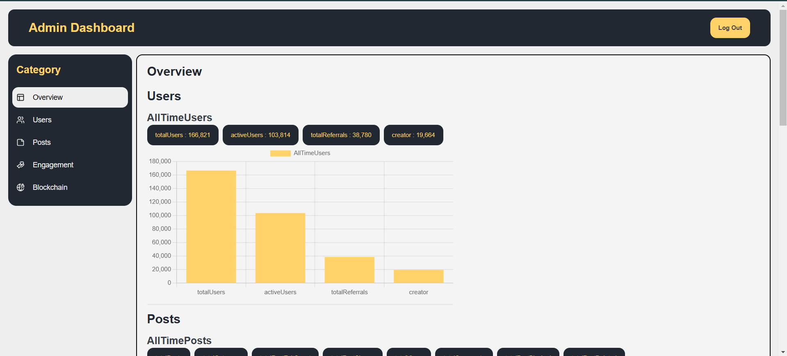
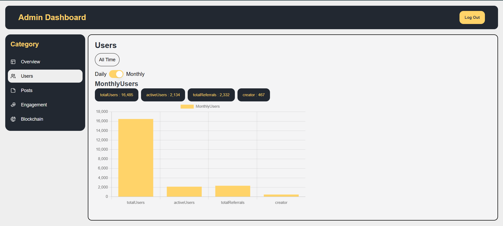

# Admin Analytics Dashboard 📊  
An analytics dashboard built using **Next.js-15**, **Chart.js**, and **Shadcn UI**, designed to provide a visually engaging and user-friendly interface for analyzing data trends and insights.

---
## 🌐 Check Live At: [Live Demo](https://admin-dashboard-chart-js.vercel.app/)
---
The Backend URL provided with the assignment was not working ( CORS Error ) So tried using my own backend that resturns same data as theirs. ( Full Stack Development )
---

## 🚀 Features  

- **Interactive Charts**: Dynamic data visualization using Chart.js.  
- **Modern Design**: Built with Shadcn UI for a sleek and intuitive design.    
- **Scalable Architecture**: Modularized backend and frontend for seamless scaling and maintenance.

---

## 📸 Screenshots  

| Dashboard Overview | Detailed Analytics |
|---------------------|--------------------|
|  |  |


---

## 🛠️ Tech Stack  

- **Frontend**:  
  - Next.js 15  
  - Shadcn UI  
  - Chart.js  

- **Backend**:  
  - Node.js (Express.js or custom setup)  
  - TypeScript  

---

## 📦 Setup  

1. **Clone the repository**:  
   ```bash  
   git clone <repolink>  
   ```  

2. **Navigate to the project directory**:  
   ```bash  
   cd AdminDashboard_ChartJS  
   ```  

3. **Install dependencies for the frontend**:  
   ```bash  
   npm install  
   ```  

4. **Set up the backend**:  
   ```bash  
   cd backend  
   npm install  
   ```  

5. **Run the backend server**:  
   ```bash  
   ./backend  
   tsc -b  
   node dist/index.js  
   ```  

6. **Run the frontend server in a new terminal**:  
   ```bash  
   ./  
   npm run dev  
   ```  

---

## 📧 Contact  

For any questions, suggestions, or issues, feel free to reach out via email or open an issue in the repository.  

Happy coding! 🚀
